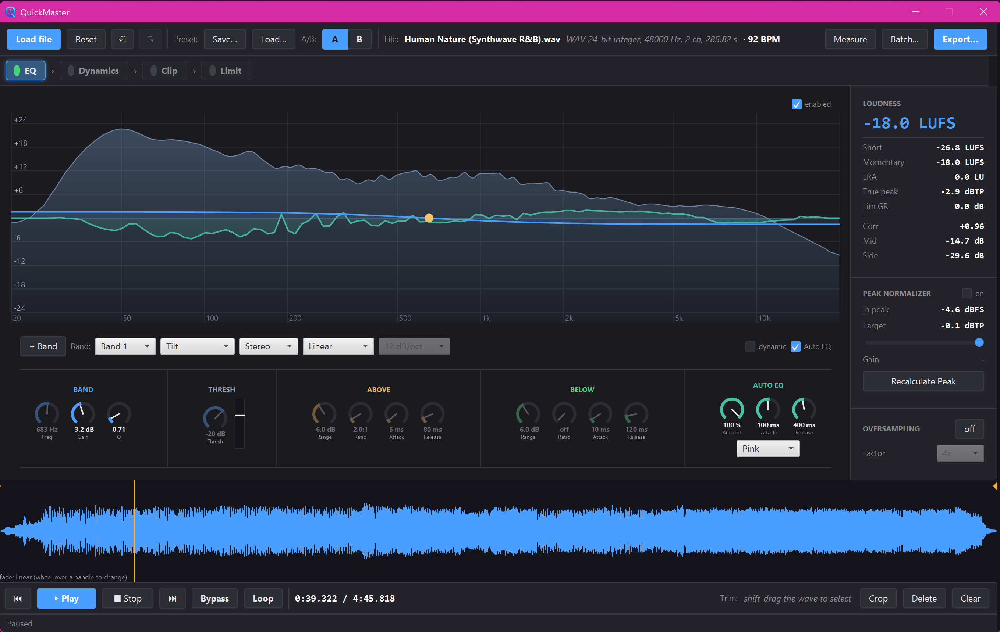

# QuickMaster

**QuickMaster takes advantage of working offline to do what a real-time tool cannot.** Because it analyses the whole track before processing a single sample, it can be automatic and intelligent: it already knows every peak, every transient and the full spectrum, and drives every decision from that complete picture, with zero-latency look-ahead and no guesswork.

From that, it masters: shape tone and stereo image, compress and level dynamics, clip and saturate, and limit to a true-peak ceiling, then export the result without opening a full DAW. QuickMaster is a JavaFX desktop application.



Built by **Cristian Moresi**, backend developer, audio-software developer and music producer. It is a young, open-source project and it will keep growing; today it already covers the essentials for quick, intelligent masters.

## Why offline?

A real-time effect only knows the past and the present; it has to guess about the future and pay for any look-ahead with latency. QuickMaster has no such constraint:

- **True zero-latency look-ahead.** The future of the signal is already known, so every transient is caught before it arrives. Attacks are effectively instantaneous, with no pre-delay and no distortion.
- **Whole-file measurement.** Loudness, peaks, the long-term spectrum, the tempo and every onset are measured over the entire track, so decisions come from complete information, not a short rolling window.
- **Deterministic processing.** Each stage precomputes a control map and applies it by absolute time position, so live playback, export and oversampled export produce identical results and seeking is always exact. The maps are recomputed in real time as you change the stages above, so what you hear is always current.

## Using QuickMaster

The chain runs `EQ -> Dynamics -> Clip -> Limit -> Peak Normalizer` by default, but the order is yours: **drag the chips in the processing-chain bar to reorder it** (put the saturation before or after the EQ, move the dynamics earlier or later, whatever suits the track), reorder the individual compressors inside Dynamics, and toggle any module on or off. The Peak Normalizer stays last so it always sets the final ceiling. Here is what each stage is for and how to get the most out of it.

### EQ (and a compressor hiding inside it)

A multi-band parametric and dynamic equalizer: bell, low and high shelf, low and high cut (6 to 48 dB/oct), notch and tilt. Each band can be routed to **Stereo, Left, Right, Mid or Side**, so the same EQ also handles L/R balance, Mid/Side tone and stereo width.

There is a deliberate trick in the **Gain** band. On its own it applies flat wideband gain, up or down. Turn on **Dynamic EQ** for that band and it becomes a full, hand-tunable compressor:

- Above the threshold it compresses like a classic downward compressor, with its own attack, release and ratio.
- Below the threshold it can lift the quiet parts (upward compression) or duck them (a gate).
- Both behaviours can act at the same time, each with independent timing.

So if you want a detailed, manually dialled compressor instead of the automatic ones, you already have one: the EQ Gain band.

**Auto EQ** matches the track's tone toward a target curve. For a typical pop master, pulling toward the **pink** curve is a good starting point; choose deeper or brighter targets (Deep, Brown, White, Blue) to taste. One **Amount** knob sets how strongly the tone is pulled.

### Dynamics (automatic, analysis-driven compression)

Four automatic look-ahead compressors. On load, QuickMaster analyses the whole track (its transients and its peak map) and precomputes each one; it recomputes in real time as you change the stages above, so it always reflects the current signal. Because it reads the entire file, each one targets exactly what it should, at a different time scale:

- **Peak Comp (micro-dynamics).** The classic "shave the peaks" compressor: a fast attack and a short release (around 60 ms, short but long enough to avoid distortion). Since the transients are known in advance, it touches **only** the loudest transients and leaves the body untouched.
- **Beat Comp (beat-level).** Glue compression that evens out the level of transients from beat to beat.
- **Leveler (macro-dynamics).** Brings clearly different song sections closer together while preserving the natural contour around the median. It leaves intentionally quiet breakdowns, fades and outros alone, and caps every boost so leveling can never raise the track's peak or steal headroom from the final normalizer.
- **Punch.** Raises **only** the transients (transient expansion), which is only possible because the onsets are declared up front.

You dial the dB of reduction (or boost) you want; the analysis derives the thresholds, sensitivity and timing.

### Clip (saturation and hard clip)

Saturation is one of the most useful mastering tools, for two reasons: shaving peaks **without losing punch**, and adding colour. When you tame a peak with saturation you are not blunting the attack of a kick or snare; you are moving that peak's energy into harmonics that spread across the spectrum. The peak comes down, but the sense of punch stays. It also fills the sound out and gives it character.

- **Soft-Clip.** You say how many dB to bring the loudest peak down, and it applies just enough saturation to hit that, exactly like the compressors solve their gain from the peak map. **Tube, Tape and Transformer** give progressively different colour and character.
- **Hard-Clip.** The same peak reduction with no colour, a hard ceiling. Use it for a clean, transparent shave or for extra loudness.

### Limit (the final touch)

An automatic two-stage **true-peak** limiter: a linear-phase multiband stage (four bands, each with its own Push) followed by a broadband brickwall (ITU-R BS.1770). It runs fully oversampled, so the limiting and the inter-sample peaks stay clean. This is the last bit of loudness and the final output ceiling.

A **Push** control says how many dB the loudest peak should come down; quieter peaks move proportionally less and the body is lifted toward the ceiling, so the result is denser and louder with the peak held exactly.

### Output

The **Peak Normalizer** sets the delivery ceiling in dBTP (default -0.1 dBTP) using true-peak measurement, and you can render with selectable **oversampling** up to 16x. Double-click its slider or value to type an exact ceiling; use a lower value such as -1 dBTP when you want extra lossy-codec safety margin. Export dialogs default to the standard delivery format of **48 kHz / 24-bit**, while retaining every other supported rate and depth as an option.

Exports are delivery-grade end to end: 16 and 24-bit renders are **TPDF-dithered**, sample-rate conversion uses a polyphase windowed-sinc resampler (anti-aliased, with the true-peak ceiling re-anchored at the delivery rate), and same-container exports keep the source's **metadata** (ID3 tags on MP3, LIST-INFO and bext chunks on WAV). The whole chain can be saved and loaded as a **preset**, compared via a two-slot **A/B settings switch** (two full chain configurations, switchable while playing, while the transport's **Bypass** compares against the original audio), and applied to a folder of songs at once with **batch export**.

## Features at a glance

- Multi-band parametric and dynamic EQ with per-band channel routing and linear or minimum phase. The linear-phase kernels span a constant time window, so the realized curve is identical at any rate or oversampling factor.
- Spectral **Auto EQ** with selectable target curves, over a live FFT analyser.
- Four automatic offline look-ahead dynamics processors with live gain-reduction metering.
- **Clip**: Tube/Tape/Transformer saturation and hard clip, dialled in dB, all antiderivative anti-aliased (ADAA).
- **Limit**: two-stage true-peak limiter, fully oversampled.
- True-peak Peak Normalizer and oversampling up to 16x.
- Proportional whole-window scaling on Windows: the fixed interface resizes as one unit, without horizontal or vertical stretching, clipping or black frames during live resize.
- Real-time playback with latency-compensated cursor and meters, a time-aligned **Bypass** (instant original-vs-master comparison), selection **looping**, an interactive waveform, non-destructive crop and trim.
- Integrated **LUFS** metering (ITU-R BS.1770), true-peak readout, phase correlation and M/S levels, all measured from the fully post-processed master even while Bypass is auditioning the source, plus a draggable processing-chain bar.
- Chain **presets** (JSON), a two-slot **A/B settings switch** for comparing two full chain configurations, and undo/redo that also covers parameter changes.
- **Batch export**: master a whole folder with the current chain.
- WAV (16, 24 and 32-bit integer, 32-bit float) and MP3 (decode and encode), with TPDF dither on reduced-depth renders and metadata preservation.

## Known limitations

- MP3 decoding goes through the decoder's 16-bit PCM output (an mp3spi limitation), so an imported MP3 carries a -96 dB quantisation floor before processing. WAV sources are decoded at their full depth.

## Download

Portable builds with a bundled Java runtime (you do **not** need Java installed) are published on the [Releases](https://github.com/CristianMoresi/QuickMaster/releases) page, one per system (Windows, macOS, Linux). Download the one for your system, unzip it and run QuickMaster. Nothing is installed: to remove it, just delete the folder. Your settings and logs are kept in your user data directory, not in the app folder.

## Build from source

QuickMaster is a Maven project requiring **JDK 17 or newer**.

The DSPark audio engine is vendored in `libs/`. Install it into your local Maven repository once:

```bash
mvn install:install-file -Dfile=libs/dspark-0.1.0.jar -DpomFile=libs/dspark-0.1.0.pom
```

Then, from the project root:

```bash
mvn clean javafx:run   # build and launch the app
mvn test               # run the unit test suite
```

## Built on DSPark

QuickMaster's audio engine is a Java port of **[DSPark](https://github.com/CristianMoresi/DSPark)**, my own C++ DSP library, packaged here as the `com.dspark:dspark` dependency. The port keeps DSPark's filter, FFT, loudness, oversampling and equalizer primitives and adds the analysis pieces this app needs (onset detection and tempo estimation) on top of them.

## Architecture

```
com.quickmaster
  audio                audio model and WAV/MP3 file I/O (format auto-detected)
  processing           the DSP pipeline and the AudioProcessor lifecycle
  processing/eq        parametric EQ and offline Auto EQ
  processing/dynamics  the four look-ahead dynamics processors
  processing/clip      soft-clip saturation and hard-clip
  processing/limit     the true-peak multiband and broadband limiter
  processing/analysis  spectrum, tempo and onset analysis
  playback             real-time streaming playback engine
  config               configuration persistence and logging
  ui                   JavaFX controller, FXML view and stylesheet
```

Audio flows through a configurable **pipeline** of processors, each following a `prepare`, `analyze`, `process` lifecycle borrowed from professional audio plug-in APIs. The analysis-driven modules precompute their control data in `analyze` and apply it by absolute playback position, so the same processors produce identical output offline (export), per-buffer (real-time playback) and oversampled.

## Author

**Cristian Moresi**, backend developer, audio-software developer and music producer.
[github.com/CristianMoresi](https://github.com/CristianMoresi)

## License

Released under the [MIT License](LICENSE).
