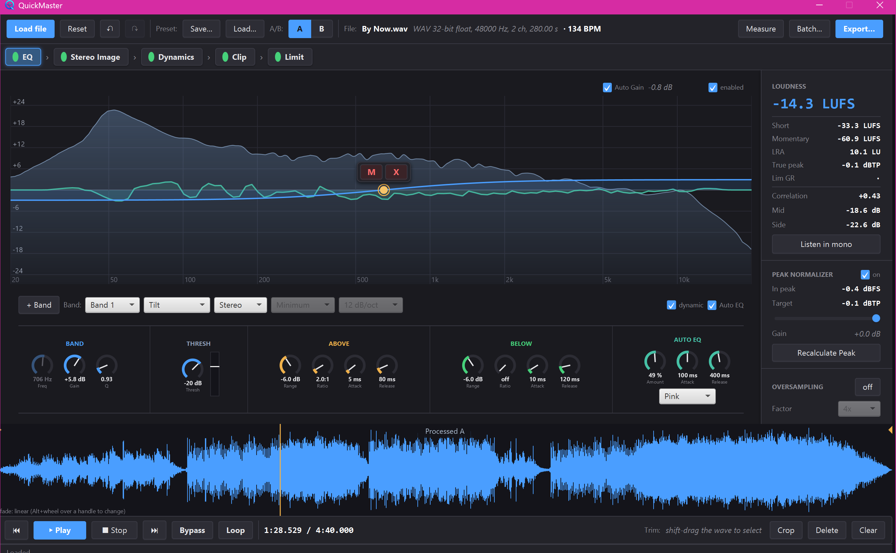

<p align="center">
  
</p>

<h1 align="center">QuickMaster</h1>

<p align="center">
  <strong>Intelligent offline mastering. Whole-track insight. Hands-on control.</strong><br />
  Shape tone, dynamics and stereo image in a portable desktop app powered by DSPark.
</p>

<p align="center">
  <a href="https://github.com/CristianMoresi/QuickMaster/releases/latest"></a>
  <a href="LICENSE"></a>
  <a href="#download"></a>
  <a href="#build-from-source"></a>
</p>

<p align="center">
  <a href="https://github.com/CristianMoresi/QuickMaster/releases/latest"><strong>Download</strong></a> ·
  <a href="#quick-start">Quick start</a> ·
  <a href="#using-quickmaster">User guide</a> ·
  <a href="CHANGELOG.md">Changelog</a> ·
  <a href="docs/VALIDATION.md">Validation</a>
</p>



## Overview

**QuickMaster uses whole-track analysis to prepare its processing before playback.** It measures loudness, peaks and spectral content, estimates tempo, and prepares gain envelopes with advance knowledge of the signal. The Leveler follows macro RMS across musical passages; it does not need to classify a passage as a verse or chorus before correcting its level.

From that, it masters: shape tone and stereo image, compress and level dynamics, clip and saturate, and limit to a true-peak ceiling, then export the result without opening a full DAW. QuickMaster is a JavaFX desktop application.

Built by **Cristian Moresi**, backend developer, audio-software developer and music producer. It is a young, open-source project and it will keep growing; today it already covers the essentials for quick, intelligent masters.

This README describes **QuickMaster 1.3.3**. See the [changelog](CHANGELOG.md)
for the changes in each release and [Releases](https://github.com/CristianMoresi/QuickMaster/releases)
for portable downloads.

> **Portable by design.** Download, extract and run. No installer and no separate
> Java installation are needed for the packaged app.

## Quick start

1. [Download the portable ZIP](https://github.com/CristianMoresi/QuickMaster/releases/latest)
   for your system, extract it and launch QuickMaster.
2. **Load file** to open a WAV or MP3. Let the initial track analysis finish.
3. Enable only the modules you need. Drag the chain chips to change their order;
   compare settings with **A/B**, the original with **Bypass**, and stereo
   compatibility with **Listen in mono**.
4. Check output headroom, choose your delivery settings and **Export**. Use
   **Batch…** to apply the chain to several files.

<details>
<summary><strong>Explore the guide</strong></summary>

- [Why offline?](#why-offline)
- [EQ — and the compressor inside it](#eq-and-a-compressor-hiding-inside-it)
- [Dynamics](#dynamics-automatic-analysis-driven-compression)
- [Analysis and responsiveness](#analysis-and-responsiveness)
- [Waveform zoom](#waveform-zoom) and [Leveler exclusions](#excluding-passages-from-the-leveler)
- [Mono monitoring](#mono-monitoring) and [Stereo Image](#stereo-image)
- [Clip](#clip-saturation-and-hard-clip), [Limit](#limit-the-final-touch) and [Output](#output)
- [Features](#features-at-a-glance) and [known limitations](#known-limitations)
- [Build from source](#build-from-source), [DSPark](#built-on-dspark) and [architecture](#architecture)

</details>

## Why offline?

A real-time effect only knows the past and the present; it has to guess about the future and pay for any look-ahead with latency. QuickMaster has no such constraint:

- **Precomputed look-ahead.** Offline gain envelopes can anticipate peaks without adding a real-time look-ahead buffer. Analysis takes time up front; filters and the audio device still have their own latency.
- **Whole-file measurement.** Loudness, peaks and the long-term spectrum use the whole track. Onsets and tempo are estimated from that signal, with uncertainty exposed in the UI.
- **Shared processing.** Playback and export use the same processors and position-indexed gain maps. Changing the sample rate or oversampling factor can intentionally change the result; it is not a promise of bit-identical audio across different render settings.

## Using QuickMaster

The chain runs `EQ -> Stereo Image -> Dynamics -> Clip -> Limit -> Peak Normalizer` by default, but the order is yours: **drag the chips in the processing-chain bar to reorder it** (put the saturation before or after the EQ, move the dynamics earlier or later, whatever suits the track), reorder the individual compressors inside Dynamics, and toggle any module on or off. The Peak Normalizer stays last so it always sets the final ceiling. Here is what each stage is for and how to get the most out of it.

### EQ (and a compressor hiding inside it)

A multi-band parametric and dynamic equalizer: bell, low and high shelf, low and high cut (6 to 48 dB/oct), notch and tilt. Each band can be routed to **Stereo, Left, Right, Mid or Side**, so the same EQ also handles L/R balance, Mid/Side tone and stereo width.

There is a deliberate trick in the **Gain** band. On its own it applies flat wideband gain, up or down. Turn on **Dynamic EQ** for that band and it becomes a full, hand-tunable compressor:

- Above the threshold it compresses like a classic downward compressor, with its own attack, release and ratio.
- Below the threshold it can lift the quiet parts (upward compression) or duck them (a gate).
- Both behaviours can act at the same time, each with independent timing.

So if you want a detailed, manually dialled compressor instead of the automatic ones, you already have one: the EQ Gain band.

**Auto EQ** matches the track's tone toward a target curve. For a typical pop master, pulling toward the **pink** curve is a good starting point; choose deeper or brighter targets (Deep, Brown, White, Blue) to taste. One **Amount** knob sets how strongly the tone is pulled.

**Auto Gain** (in the EQ header) compensates the manual/dynamic EQ's level with
DSPark K-weighting. It applies one fixed, stereo-linked gain to the whole song,
preserving the EQ curve and musical dynamics, and reduces it further if needed
to avoid overload. Nonzero compensation is shown beside the checkbox; the readout
stays blank when inactive or rounded to 0.0 dB. The checkbox alone indicates
whether Auto Gain is enabled. It defaults on and
is saved in presets, A/B and undo history. Turn it off for manual gain/headroom;
overloaded peaks are then correctly shown in red. This is separate from Auto EQ.
While active, and with no active Stereo Image stage after the EQ, a final
attenuation-only safety trim also checks the actual output after oversampling
and sample-rate conversion (−0.1 dBTP on overload), even with Peak Normalizer off.
An enabled Peak Normalizer uses its selected target instead.
The final trim appears in the Peak Normalizer's Gain readout. Neither gain stage
clips samples or acts as a compressor; Bypass still plays the untouched original.

**Interactive EQ audition.** Band edits are heard through a separate short-window
preview worker while the exact whole-song master is recalculated in the background.
The preview preserves the selected phase, routing, oversampling and chain order;
downstream offline processors temporarily retain their last completed analysis.
`Preview` and `≈` mark provisional local gain estimates. Auto Gain/normalizer
monitoring uses linked linear attenuation with extra headroom, not saturation.
Very long filter/detector histories use bounded pre-roll during preview. The
waveform is explicitly marked as updating until the full render is available.
Preview audio never enters export or the definitive A/B cache. Completion is
crossfaded at the same source position; no playback restart is required.
Preview needs a completed plan for the current track context. Source, tempo,
exclusion and non-EQ changes require a fresh offline plan before EQ audition
can reuse it. High oversampling can still make complete renders expensive.

### Dynamics (automatic, analysis-driven compression)

Four automatic look-ahead compressors. QuickMaster analyses the track and prepares their envelopes in the background. Upstream changes invalidate affected analysis; superseded requests are cancelled and only the latest completed plan can become current. Each compressor works at a different time scale:

- **Peak Comp (micro-dynamics).** A stereo-linked peak reducer with a smooth 2 ms anticipatory attack and a measured 60–250 ms release. It contains peaks from the first sample onward. The body is also attenuated during lookahead/release; distant below-threshold passages remain unchanged. The available reduction is bounded by the measured peak-to-body headroom.
- **Beat Comp (beat-level).** Turns down transients louder than the median transient, with a stereo-linked gain envelope. The reduction target is a maximum, including while a previous analysis is being replaced. Release follows the selected note value and detected or manual BPM. `auto?` marks an uncertain estimate; disable Auto to enter the intended musical tempo. If no reliable single tempo is available, release falls back to 250 ms.
- **Leveler (macro-dynamics).** Raises quieter sustained passages toward the strongest 3-second RMS in the input, never attenuating them or boosting above that macro RMS reference. **Leveling** scales the intended correction in dB; 100% makes sustained passages converge where the activity floor, +24 dB boost limit and smooth transitions permit. **Speed** changes the macro response (6-second context at minimum, 2 seconds at maximum). It does not flatten transients or normalize silence/noise. To preserve an intro, break or outro, use **Exclude regions** and paint it red on the waveform (see below). Peaks can require extra headroom: use the separate Limit/Peak Normalizer stages for a delivery ceiling. The Leveler does not hide a global attenuation or a peak limiter. RMS is measured over seconds and does not imply identical LUFS for different spectra.
- **Punch.** Boosts detected attacks with a stereo-linked envelope. DSPark SuperFlux separates transient detection from the strong-pulse tempo map, so a loud section does not set a global strength gate for a quiet section. Local waveform refinement aligns the rise before the attack; overlapping boosts never add beyond Amount. The body outside attack/release regions stays unchanged. Detection is heuristic, particularly in dense mixes and at the file boundaries.

You dial the dB of reduction (or boost) you want; the analysis derives the thresholds, sensitivity and timing.

### Analysis and responsiveness

The first load needs source and structural analysis. Later edits reuse valid
features, skip unused stages and keep only the latest pending analysis request.
The current audio plan becomes available before presentation statistics finish;
stopped-state meters show `…` while those statistics are pending. Pressing Play
while the plan is being prepared queues playback; Stop cancels that request.
Analysis is still offline computation, not an instantaneous operation. Measured
latencies, test conditions and limits are recorded in
[the performance validation](docs/diagnostics/performance-p1-validation.md).

The A/B settings switch reuses each slot's completed, source-aligned PCM. A new
slot with identical settings shares the already approved audio immediately.
When a variant needs rendering, its unchanged EQ/fade prefix is reused; the
remaining stages and any oversampling still run at full quality. Changing the
source, parameters or exclusion regions invalidates the affected cached audio.
No lower-quality preview is substituted for either slot.

### Waveform zoom

The waveform shows the **actual processed audio**, updated when a completed
render becomes audible. It follows the active A/B render; **Bypass** shows the
original. While new settings are being computed, the last approved waveform
remains visible with an updating label. The vertical scale stays fixed at
0 dBFS so gain and limiting changes remain visible; red tips mark samples
above that level. Zoom/pan redraws reuse peak indexes, without rerunning DSP.

Scroll over the waveform to move the visible timeline horizontally, without seeking, pausing or changing playback. Wheel up reveals earlier audio; wheel down reveals later audio. Panning follows the current zoom level and stops at the track edges. Hold **Ctrl** while scrolling to zoom in or out on Windows/Linux; use **Command** on macOS. The time under the pointer stays anchored. Selection, playhead and fade handles use the same view coordinates. Zoom outward to return to the full track. **Alt + wheel** over a fade handle changes its curve; the unmodified wheel only moves the view, including over handles.

### Excluding passages from the Leveler

In Dynamics → Leveler, enable **Exclude regions**, then drag over the waveform.
Red regions receive exactly zero Leveler gain; EQ and the other effects still
apply. Drag a region edge to resize it, or right-click for **Edit exclusion
times…** and **Remove exclusion**. **Clear all** removes every region; undo/redo
restores edits. Press **Esc** to cancel a drag or leave exclusion mode. Exclusion
gestures do not seek or change the loop, and waveform pan/zoom still work.

Regions belong to the track and are shared by A/B. They are saved separately in
your user settings and restored when the unchanged source file is loaded again;
the original audio is never edited. Crop/delete remap regions on the edited
timeline, and undo restores them. Edited timelines remain session-only. Generic
chain presets and batch processing do not carry exclusions into unrelated tracks.

### Mono monitoring

**Listen in mono**, below the right-hand Correlation / Mid / Side meters, folds
the audition to `(L + R) / 2` in both speakers. It starts off and switches smoothly
without restarting playback or recalculating the master. It applies to preview,
Bypass and either A/B slot, but never changes processing, export, presets or the
stereo master meters. This is a listening check, not a mono export mode.

### Stereo Image

An optional, reorderable module between EQ and Dynamics by default. Its three
sections are independent and start switched off. Turning on a section also
enables the module; it never turns on the other two sections:

- **Generation** adds a new, pure-Side difference from smoothly moving
  differential EQ bands. It does not simply turn up the existing Side.
  Amount mixes the difference into the unchanged original, with a deliberately
  strong maximum; its starting and reset value is 25%.
- **Generated Stereo Low Cut** replaces the bass checkbox. Leftmost **Off** is the
  new default: generate all frequencies. Move the logarithmic slider from 20 Hz to
  5 kHz to filter only the new delta with a compensated linear-phase FIR; the
  displayed frequency is its -6 dB point. The original bass is never filtered or
  made mono. Old presets retain the former 150–200 Hz transition (175 Hz center).
  Near or above the source Nyquist limit the generated delta is fully rejected.
  Harmonic color is automatic and
  blended only into the L/R differences, using DSPark and internal 8x oversampling
  at 44.1/48 kHz with rate-adaptive factors at higher processing rates. It has no
  separate switch and does not saturate the original audio.
- **Side Leveler** raises or lowers the combined Side toward a measured energy
  reference, with smooth offline automation. Amount scales the log-gain correction;
  100% requests the complete correction, subject to usable signal and the
  +12 / −24 dB range. It cannot create Side from zero: use Generation for that.
- **Side Guard** only attenuates Side above the reference plus its adjustable
  margin, using 40 ms energy windows and anticipation. It is not a true-peak
  limiter or a universal phase-safety certification.
- **Side Gain** applies -12 to +12 dB to the final combined Side after Leveler and
  Guard, without changing Mid. Default 0 dB; positive gain can deliberately exceed
  the Guard target. Slider values are readouts, with no popup dialogs;
  double-click a slider track to reset it.

Choose **Auto (This Track)**, one of ten measured genre references, or import a
stereo WAV/MP3 with **Reference…**. Auto retains the track's post-generation
whole-file balance as its reference. Genre values are equal-recording means from
five public streaming references each, not a claim of universally optimal width.
**Reference / Custom** also permits direct adjustment of the Side-energy target.
Mid and Side percentages sum to 100% of energy, not perceived volume.

The module preserves the mono sum; downstream nonlinear processing may change it.
Generation does not secretly attenuate the full mix, including when generated
bass is enabled. An upstream EQ Auto Gain remains scoped to that EQ, not the new
stereo added afterwards. Strong widening can exceed digital headroom: an output
warning asks you to reduce Amount or explicitly enable Limit / Peak Normalizer.
Those downstream processes can then change level; with them off, floating-point
audio remains untrimmed and playback/integer export may clip if overloaded.
True mono files remain mono and display an explanation; dual-mono stereo files
can generate new Side. Legacy presets load Stereo Image bypassed.

Edits use the cancellable preview worker while the final offline render is
prepared. Provisional previews are labelled; final A/B, export, batch, waveform
and energy meters use the completed render. A bounded 256 MiB delta cache reuses
full-quality synthesis across Amount, section and Side Gain edits. Changing Low
Cut only rebuilds filtering. Changes to upstream audio invalidate it; oversized
tracks safely use the uncached path. Global oversampling still renders the full
high-rate chain. Tests and validation are recorded in
[Stereo power and gain correction](docs/diagnostics/stereo-power-correction.md)
and [Stereo controls and performance](docs/diagnostics/stereo-interaction-results.md).
The [reference study](docs/research/stereo-study-20260928/INFORME-RESULTADOS.md)
lists the 50 recordings, ten families, measurement method and limitations.

### Clip (saturation and hard clip)

Clipping lowers peaks by nonlinear waveshaping and adds harmonics. It can retain a sharper attack than a long gain-reduction envelope, but stronger settings also change timbre and can sound distorted. Even hard clipping adds colour; transparency is not guaranteed.

- **Soft-Clip.** Calibrates the selected curve to the requested base-rate program-peak reduction. **Analog** uses a unit-slope sine curve; **Soft (tanh)** rounds the body gently; **Golden knee** leaves its below-knee region exactly linear. These are symmetric DSPark clipping curves, not physical circuit emulations. No hidden stereo drift or high-pass filter.
- **Hard-Clip.** Choose **Hard** for a literal ceiling with unchanged samples below it, or **Soft** for a tanh knee. The curve is saved with the preset and restored by A/B.

Zero is exact bypass. Use **Oversampling** to reduce nonlinear aliasing: 1x
clipping is not alias-free. GR displays the actual input/output peak reduction
of each stage before output normalization; reconstructed oversampled peaks can
differ from the base-rate target. Old Tube/Tape/Transformer preset slots map to
Analog/Soft (tanh)/Golden knee respectively. Their corrected sound intentionally
differs from the old asymmetric Java saturation models; see the
[DSP audit and migration record](docs/diagnostics/dynamics-clips-audit.md).

### Limit (the final touch)

An offline two-stage limiter: a linear-phase multiband stage (four bands, each with its own Push) feeds the broadband true-peak-aware limiter **in series**. Both use smooth lookahead and calibrated release. Broadband's ceiling is anchored to the signal **before Multiband**, so band edits cannot raise its reference and cancel their own effect through output normalization.

Band **Push** adds drive while holding each band's original peak. Broadband **Push** adds input gain to the already processed multiband signal; it is not a maximum-GR setting. Its knob never changes when bands change, and its meter shows the actual attenuation, which can exceed Push when the bands have already added drive. At zero broadband Push the stage still catches multiband peaks above the shared reference. The base-rate float output is checked for newly created inter-sample peaks; the separate **Peak Normalizer** measures the final waveform after oversampling/sample-rate conversion and sets the delivery ceiling. Multiband processing can change phase cancellation and timbre, so instantaneous GR is signal-dependent, not required to increase at every sample.

### Output

The **Peak Normalizer** sets the delivery ceiling in dBTP (default -0.1 dBTP) using true-peak measurement, and you can render with selectable **oversampling** up to 16x. Double-click its slider or value to type an exact ceiling; use a lower value such as -1 dBTP when you want extra lossy-codec safety margin. Export dialogs open on your **desktop** (afterwards on the folder of your last export) and default to the standard delivery format of **48 kHz / 24-bit**, while retaining every other supported rate and depth as an option.

Exports are delivery-grade end to end: 16 and 24-bit renders are **TPDF-dithered**, sample-rate conversion uses a polyphase windowed-sinc resampler (anti-aliased, with the true-peak ceiling re-anchored at the delivery rate), and same-container exports keep the source's **metadata** (ID3 tags on MP3, LIST-INFO and bext chunks on WAV). The whole chain can be saved and loaded as a **preset**, compared via a two-slot **A/B settings switch** (two full chain configurations, switchable while playing, while the transport's **Bypass** compares against the original audio), and applied to a folder of songs at once with **batch export**.

## Features at a glance

- Multi-band parametric and dynamic EQ with per-band channel routing and linear or minimum phase. The linear-phase kernels span a constant time window, so the realized curve is identical at any rate or oversampling factor.
- Spectral **Auto EQ** with selectable target curves, over a live FFT analyser.
- Optional EQ **Auto Gain**, with short-window audition while the exact master
  is recalculated in the background.
- **Stereo Image**: parallel stereo generation, generated-only linear-phase Low
  Cut, Side Leveler, Side Guard and independent Side Gain; all sections opt-in.
- Four automatic offline look-ahead dynamics processors with live gain-reduction metering.
- **Clip**: calibrated DSPark sine, tanh, golden-knee and hard-clamp curves, actual-render GR meters and explicit pipeline oversampling.
- **Limit**: two-stage true-peak limiter, fully oversampled.
- True-peak Peak Normalizer and oversampling up to 16x.
- Proportional whole-window scaling on Windows: the fixed interface resizes as one unit, without horizontal or vertical stretching, clipping or black frames during live resize.
- Real-time playback with latency-compensated cursor and meters, a time-aligned **Bypass** (instant original-vs-master comparison), selection **looping**, an interactive waveform, non-destructive crop and trim.
- Integrated **LUFS** metering (ITU-R BS.1770), true-peak readout, phase correlation and M/S levels, all measured from the fully post-processed master even while Bypass is auditioning the source, plus a draggable processing-chain bar.
- Playback-only **Listen in mono**, with smooth switching and no reanalysis.
- Chain **presets** (JSON), a two-slot **A/B settings switch** for comparing two full chain configurations, and undo/redo that also covers parameter changes.
- **Batch export**: master a whole folder with the current chain.
- WAV (16, 24 and 32-bit integer, 32-bit float) and MP3 (decode and encode), with TPDF dither on reduced-depth renders and metadata preservation.

## Known limitations

- MP3 decoding goes through the decoder's 16-bit PCM output (an mp3spi limitation), so an imported MP3 carries a -96 dB quantisation floor before processing. WAV sources are decoded at their full depth.
- Whole-track analysis and initial stereo synthesis still take time, especially
  with high oversampling. Provisional audition is not the completed export.
- Stereo profile percentages describe measured energy, not ideal perceived
  width. Strong generation or Side Gain can overload output unless you reduce
  the amount or explicitly use the downstream limiter/normalizer.

## Download

Portable builds with a bundled Java runtime (you do **not** need Java installed) are published on the [Releases](https://github.com/CristianMoresi/QuickMaster/releases) page, one per system (Windows, macOS, Linux). Download the one for your system, unzip it and run QuickMaster. Nothing is installed: to remove it, just delete the folder. Your settings and logs are kept in your user data directory, not in the app folder.

## Build from source

QuickMaster is a Maven project requiring **JDK 17 or newer**.

Audited Windows builds use Temurin **25.0.4.7**, including the DSPark build;
the exact dependency hash is checked by the acceptance suite. See `docs/VALIDATION.md`.

The DSPark Java sources and tests are versioned in `vendor/dspark-java/`. Build and install them first (the audited binary is also retained in `libs/`):

```bash
mvn -f vendor/dspark-java/pom.xml clean install
```

Then, from the project root:

```bash
mvn clean javafx:run   # build and launch the app
mvn test               # requires the official corpus properties documented below
```

The complete test and package workflow requires the external ITU/EBU test signals and the applicable EBU usage authorization. See [validation and portable delivery](docs/VALIDATION.md) for the required Maven properties and Windows app-image commands. The official audio is not redistributed in this repository.

### Latest local validation

The 2026-09-29 Windows build passed **921 application tests** and **140 DSPark
tests**. An additional **371 tests** ran against the delivered JAR, followed by
real-controller UI checks and silent PCM16 mono-switching checks with real music.
The portable's files and JAR were verified and its executable started cleanly.
See the [mono-monitor delivery record](docs/diagnostics/mono-monitor.md) for the
artifact hash, evidence and scope. These checks are not a claim of universal
audio quality, human listening validation or a new published release.

## Built on DSPark

QuickMaster's audio engine is a Java port of **[DSPark](https://github.com/CristianMoresi/DSPark)**, my own C++ DSP library, packaged here as the `com.dspark:dspark` dependency. The port keeps DSPark's filter, FFT, loudness, oversampling and equalizer primitives and adds the analysis pieces this app needs (onset detection and tempo estimation) on top of them.

Java 0.2 incorporates an audited set of kernels from C++ commit `9330f1c`,
including FFT, oversampling and finite-file true-peak improvements. It preserves
QuickMaster's existing EQ voicing and offline dynamics; it is not a complete
feature-for-feature port of every C++ effect. See the
[migration record](docs/diagnostics/dspark-java-0.2-migration.md).

Java 0.2.2 adds the offline SuperFlux path and corrected canonical clipping
transfers checked against C++ `474b7d1`, while keeping the audited tempo map.
Native reference vectors, stereo extensions and intentionally unsupported C++
features are documented in the [dynamics/clip audit](docs/diagnostics/dynamics-clips-audit.md).

The current dependency is **DSPark Java 0.2.3**, adding the native-verified
K-weighted Auto Gain port and its whole-file fixed-gain extension. See the
[EQ Auto Gain audit](docs/diagnostics/eq-autogain-audit.md).

## Architecture

```
com.quickmaster
  audio                audio model and WAV/MP3 file I/O (format auto-detected)
  processing           the DSP pipeline and the AudioProcessor lifecycle
  processing/eq        parametric EQ and offline Auto EQ
  processing/stereo    differential stereo generation and Side regulation
  processing/dynamics  the four look-ahead dynamics processors
  processing/clip      soft-clip saturation and hard-clip
  processing/limit     the true-peak multiband and broadband limiter
  processing/analysis  spectrum, tempo and onset analysis
  playback             streaming, cancellable local previews and mono monitoring
  config               configuration persistence and logging
  ui                   JavaFX controller, FXML view and stylesheet
```

Audio flows through a configurable **pipeline** of processors, each following a `prepare`, `analyze`, `process` lifecycle borrowed from professional audio plug-in APIs. The analysis-driven modules precompute their control data in `analyze` and apply it by absolute playback position. Partition-equivalence tests cover block processing at fixed settings; oversampling and sample-rate conversion have separate numeric and signal tests.

## Author

**Cristian Moresi**, backend developer, audio-software developer and music producer.
[github.com/CristianMoresi](https://github.com/CristianMoresi)

## License

Released under the [MIT License](LICENSE).
